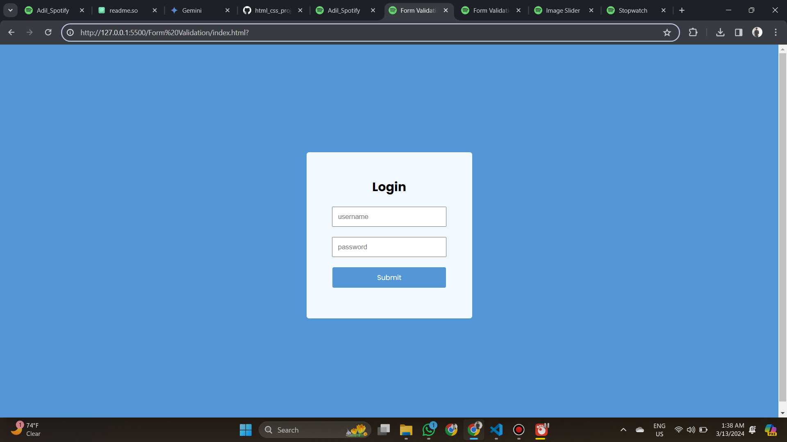

## Form Validation
Form validator using HTML, CSS, and JavaScript is a valuable tool for creating robust and user-friendly web forms.

## Live ->  https://cerulean-pie-7de3e1.netlify.app/

## Laptop Preveiw    
"Screenshot"

## Feedback

If you have any feedback, please reach out to me at sarfarazadil18@gmail.com

