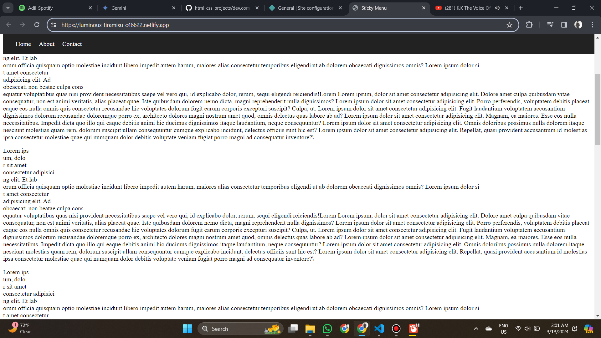

## Sticky menu
A sticky menu, also known as a fixed navbar, is a navigation bar that remains fixed at the top of the webpage even when you scroll up.

## Live -> https://luminous-tiramisu-c46622.netlify.app/

## Laptop Preveiw    
"Screenshot"

## Feedback

If you have any feedback, please reach out to me at sarfarazadil18@gmail.com

