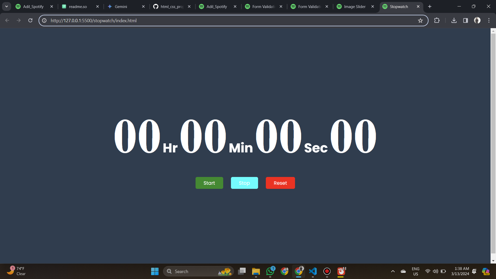

## Stop Watch
A stopwatch built with HTML, CSS, and JavaScript offers a user-friendly way to track elapsed time. Here's a breakdown of its components:

## Live ->  https://cool-taffy-d50376.netlify.app/

## Laptop Preveiw    
"Screenshot"

## Feedback

If you have any feedback, please reach out to me at sarfarazadil18@gmail.com

