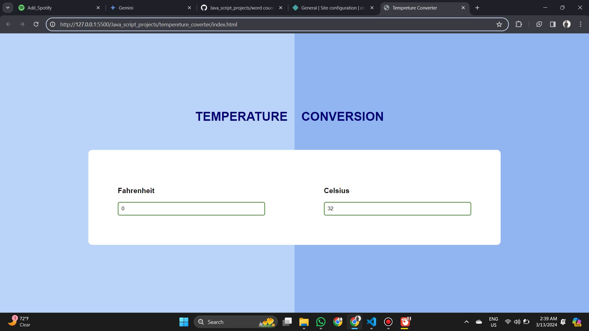

## Tempereture Converter
A temperature converter built with HTML, CSS, and JavaScript offers a user-friendly interface to convert between temperature scales

## Live ->  https://imaginative-naiad-e59117.netlify.app/

## Laptop Preveiw    
"Screenshot"

## Feedback

If you have any feedback, please reach out to me at sarfarazadil18@gmail.com

